# 🔐 Secured Order Gateway

An end-to-end **SAP Integration Suite** portfolio project combining **Cloud Integration (CPI)** and **API Management** to build a secured, production-style order intake pipeline — from a raw HTTPS batch submission to a mapped, aggregated, policy-protected API.

---

## 📌 Overview

`SecuredOrderGateway` accepts a batch of JSON orders over HTTPS, converts and splits them for individual processing, transforms each order through a Message Mapping, re-aggregates the results, and forwards them to a downstream receiver — all fronted by an API Management proxy enforcing API key authentication, rate limiting, and usage quotas.

This project was built to demonstrate practical, hands-on competency across the full SAP Integration Suite stack: iFlow design, message transformation, error handling, and API security — not just individual feature knowledge in isolation.

---

## 🏗️ Architecture


```mermaid
flowchart LR
    Client[Postman / curl client] -->|HTTPS + apikey| Proxy[API Management Proxy]

    subgraph "API Management"
        Proxy --> VerifyKey[Verify API Key]
        VerifyKey --> Spike[Spike Arrest - 10ps]
        Spike --> Quota[Quota - 1000/day]
    end

    Quota -->|Forward| CPI

    subgraph "Cloud Integration - SecuredOrderGateway_iFlow"
        CPI[HTTPS Sender] --> Converter[JSON to XML Converter<br/>wraps root element: root]
        Converter --> Splitter[General Splitter<br/>XPath: //root/Order]
        Splitter -->|per order| Mapping[Order Mapping]
        Mapping --> Gather[Gather - Combine algorithm]
        Gather --> End[End Event]
    end

    End -->|HTTP POST| Receiver[Receiver1: postman-echo.com<br/>mock downstream system]
    Receiver -.->|Response| Client

    Mapping -.->|on error| Exception[Exception Subprocess]
    Exception -.->|clean JSON error| Client
```

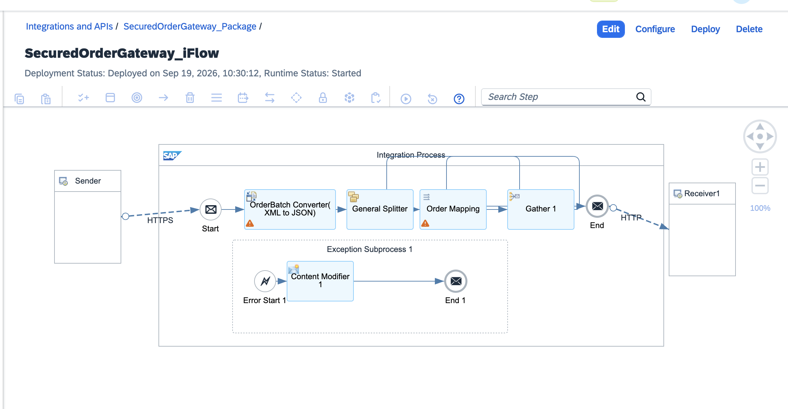
*The deployed `SecuredOrderGateway_iFlow`: Sender → Converter → Splitter → Mapping → Gather → End, with the Exception Subprocess running in parallel.*

**Flow summary:**
1. Client submits a batch of orders as JSON over HTTPS.
2. API Management validates the API key, enforces burst (Spike Arrest) and daily (Quota) limits.
3. CPI's JSON-to-XML Converter wraps the payload under a `<root>` element (configured explicitly — "Add XML Root Element" = `root`).
4. The General Splitter divides the batch using XPath `//root/Order`, producing one message per order.
5. Each order is transformed via Message Mapping (field renaming + a computed `ProcessedTimestamp`).
6. A **Gather** step (Aggregation Algorithm: `Combine`) recombines all processed orders into a single aggregated response — overriding CPI's default `UseOriginalAggregationStrategy`, which would otherwise return the original unprocessed request.
7. The combined result is sent to `Receiver1` (currently `postman-echo.com`, standing in as a mock downstream system in this trial environment), and returned to the caller.
8. Any mapping/validation failure is caught by an **Exception Subprocess** (Error Start → Content Modifier capturing `${exception.stacktrace}` / `${exception.message}` → End), returning a clean JSON error instead of a raw stack trace.

| Step | Configuration |
|---|---|
| 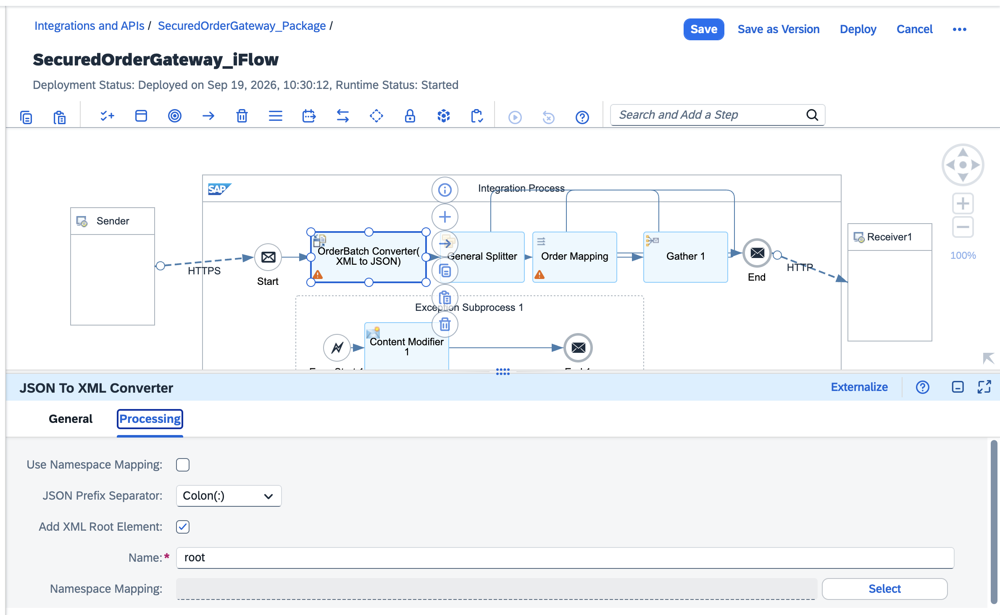 | **JSON to XML Converter** — "Add XML Root Element" explicitly set to `root`, which is why every downstream XPath targets `//root/...` regardless of the JSON's own top-level key. |
| 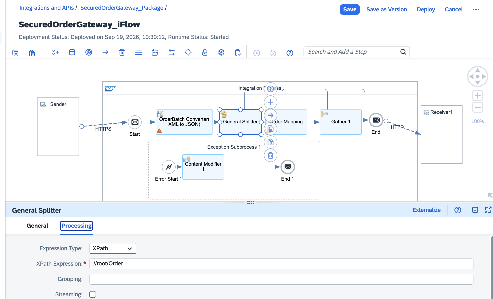 | **General Splitter** — XPath Expression `//root/Order`, splitting the batch into one message per order. |
| 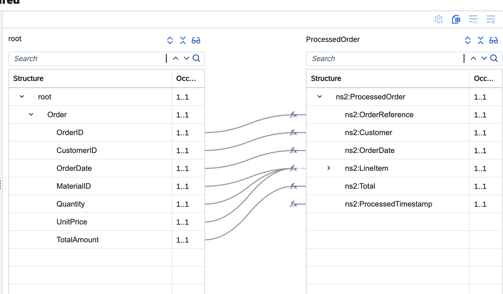 | **Order Mapping** — field-level mapping from `root/Order` (`OrderID`, `CustomerID`, `OrderDate`, `MaterialID`, `Quantity`, `UnitPrice`, `TotalAmount`) to `ns2:ProcessedOrder` (`OrderReference`, `Customer`, `OrderDate`, `LineItem`, `Total`, `ProcessedTimestamp`). |
| 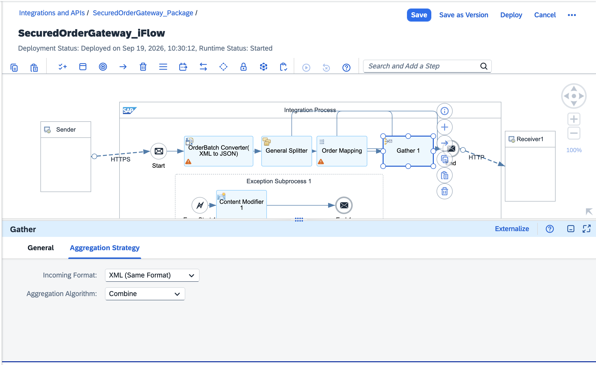 | **Gather** — Incoming Format `XML (Same Format)`, Aggregation Algorithm `Combine`, overriding CPI's default `UseOriginalAggregationStrategy`. |
| 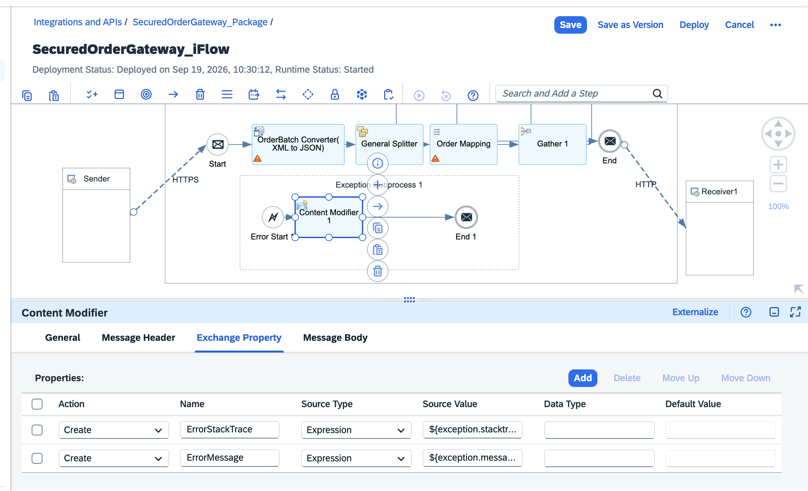 | **Exception Subprocess** — Content Modifier creating `ErrorStackTrace` (`${exception.stacktrace}`) and `ErrorMessage` (`${exception.message}`) properties before returning a clean error. |

---

## ✨ Key Features

| Layer | Capability |
|---|---|
| **CPI iFlow** | JSON↔XML conversion (explicit `root` wrapper), General Splitter (XPath `//root/Order`), Message Mapping, Gather aggregation (`Combine` algorithm), Exception Subprocess with structured error capture |
| **API Management** | Verify API Key, Spike Arrest (10 requests/sec), Quota Policy (1000 requests/day) |
| **Error Handling** | Structural validation failures return clean `{"status": "error", "message": "..."}` JSON instead of raw exceptions; exception details captured via `ErrorStackTrace` / `ErrorMessage` properties |
| **Testing** | Validated via Postman and curl against both the raw CPI endpoint and the API Management proxy, including deliberate rate-limit and quota-violation tests |

---

## 🧩 Technical Challenges Solved

This project involved genuine debugging, not just following a tutorial — several notable issues resolved along the way:

- **Namespace mismatch in Message Mapping**: the JSON-to-XML converter produced unqualified (no-namespace) XML, but an early source XSD required namespace-qualified elements — causing silent mapping failures. Fixed by rebuilding the source schema to match the converter's actual output.
- **Default Splitter aggregation behavior**: without an explicit Aggregation Strategy, CPI/Camel defaults to `UseOriginalAggregationStrategy` — meaning the *original, unprocessed* request is returned to the caller regardless of how each split branch is processed. Solved by adding an explicit **Gather** step with **Incoming Format: XML (Same Format)** and **Aggregation Algorithm: Combine**, which returns the real, mapped results instead.
- **Wrong mapping reference reused from an earlier project**: Message Mapping 1 was initially wired to a `ProductHierarchyMapping` (source root `ns2:ProductHierarchy → MainCategory → Category → Product`) left over from an unrelated Book Hierarchy project. It deployed cleanly with no design-time error, but failed at runtime because a split `Order` element doesn't structurally match a `ProductHierarchy` root. Resolved by building a dedicated `Order.xsd` → `ProcessedOrder.xsd` mapping instead of forcing an unrelated schema to fit.
- **SAP API Management policy schema quirks**: policies required the `xmlns="http://www.sap.com/apimgmt"` namespace and did **not** support generic Apigee-style `name`/`DisplayName` attributes — resolved by deriving the correct schema directly from SAP's own auto-generated policy templates rather than generic documentation.
- **Inconsistent API key location across policies**: `VerifyAPIKey` was configured to read `request.queryparam.apikey`, while `SpikeArrest` and `Quota` were both configured to read `request.header.apikey`. Requests sending the key only as a query parameter passed authentication but were evaluated against an empty identifier by the rate-limit policies — worth standardizing on one location across all three policies.
- **Gather's multimap output nests all results under one message slot**: for a multi-order batch, all processed orders come back inside a single `<multimap:Message1>` wrapper (`<multimap:Messages><multimap:Message1>...order 1...order 2...</multimap:Message1></multimap:Messages>`), not one `Message1`/`Message2` per split branch. This is Gather's actual default behavior, not a bug — worth documenting explicitly since it's easy to mistake for one.

---

## 🔌 API Reference

**Endpoint:**
```
POST https://70ef4d70trial-trial.integrationsuitetrial-apim.ap21.hana.ondemand.com/70ef4d70trial/orders-gateway/v1
```

**Headers / Query Params:**
| Name | Location | Required |
|---|---|---|
| `apikey` | Header or Query Param | ✅ |
| `Content-Type` | Header | `application/json` |

**Sample Request Body** *(matches the deployed `//root/Order` Splitter expression)*:
```json
{
  "Order": [
    {
      "OrderID": "ORD-1001",
      "CustomerID": "CUST-2001",
      "OrderDate": "2026-09-16",
      "MaterialID": "MAT-500",
      "Quantity": 2,
      "UnitPrice": 150.00,
      "TotalAmount": 300.00
    },
    {
      "OrderID": "ORD-1002",
      "CustomerID": "CUST-2002",
      "OrderDate": "2026-09-16",
      "MaterialID": "MAT-501",
      "Quantity": 1,
      "UnitPrice": 75.50,
      "TotalAmount": 75.50
    }
  ]
}
```

**Sample Success Response** *(aggregated, mapped result for a 2-order batch — note both orders nest inside a single `Message1`)*:
```xml
<multimap:Messages xmlns:multimap="http://sap.com/xi/XI/SplitAndMerge">
  <multimap:Message1>
    <ns2:ProcessedOrder xmlns:ns2="urn:securedordergateway:processedorder">
      <ns2:OrderReference>ORD-1001</ns2:OrderReference>
      <ns2:Customer>CUST-2001</ns2:Customer>
      <ns2:OrderDate>2026-09-16</ns2:OrderDate>
      <ns2:LineItem>
        <ns2:Material>MAT-500</ns2:Material>
        <ns2:Qty>2</ns2:Qty>
        <ns2:Price>150.00</ns2:Price>
      </ns2:LineItem>
      <ns2:Total>300.00</ns2:Total>
      <ns2:ProcessedTimestamp>2026/09/19</ns2:ProcessedTimestamp>
    </ns2:ProcessedOrder>
    <ns2:ProcessedOrder xmlns:ns2="urn:securedordergateway:processedorder">
      <ns2:OrderReference>ORD-1002</ns2:OrderReference>
      <ns2:Customer>CUST-2002</ns2:Customer>
      <ns2:OrderDate>2026-09-16</ns2:OrderDate>
      <ns2:LineItem>
        <ns2:Material>MAT-501</ns2:Material>
        <ns2:Qty>1</ns2:Qty>
        <ns2:Price>75.50</ns2:Price>
      </ns2:LineItem>
      <ns2:Total>75.50</ns2:Total>
      <ns2:ProcessedTimestamp>2026/09/19</ns2:ProcessedTimestamp>
    </ns2:ProcessedOrder>
  </multimap:Message1>
</multimap:Messages>
```

**Sample Error Response** *(validation/mapping failure — caught by Exception Subprocess)*:
```json
{
  "status": "error",
  "message": "Cannot produce target element ... Queue has not enough values in context."
}
```

**Sample Rejected Response** *(missing/invalid API key)*:
```json
{
  "fault": {
    "faultstring": "Failed to resolve API Key variable request.queryparam.apikey",
    "detail": { "errorcode": "steps.oauth.v2.FailedToResolveAPIKey" }
  }
}
```

**Sample Rate-Limited Response** *(Spike Arrest violation — burst of 15 concurrent requests against a 10/sec limit)*:
```json
{
  "fault": {
    "faultstring": "Spike arrest violation. Allowed rate : MessageRate{messagesPerPeriod=10, periodInMicroseconds=1000000, maxBurstMessageCount=1.0}",
    "detail": { "errorcode": "policies.ratelimit.SpikeArrestViolation" }
  }
}
```

**Sample Quota-Exceeded Response** *(daily quota of 1000 requests exhausted)*:
```json
{
  "fault": {
    "faultstring": "Rate limit quota violation. Quota limit exceeded. Identifier : _default",
    "detail": { "errorcode": "policies.ratelimit.QuotaViolation" }
  }
}
```

> **Note:** SAP API Management returns HTTP `500` for both Spike Arrest and Quota violations, not the more conventional `429` — worth confirming expected status codes per policy type rather than assuming REST norms apply uniformly. `VerifyAPIKey` failures, by contrast, return `401`.

### Evidence — a real run, end to end

| | |
|---|---|
| 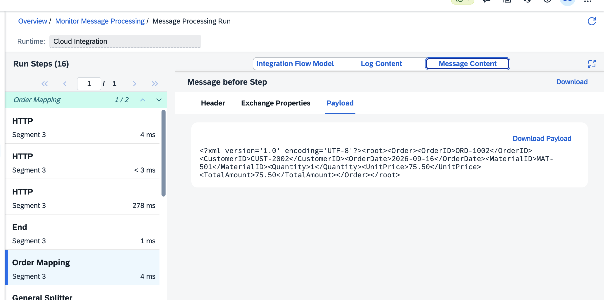 | Message before the Order Mapping step — the `root/Order` XML produced by the Converter + Splitter, exactly matching the deployed XPath. |
| 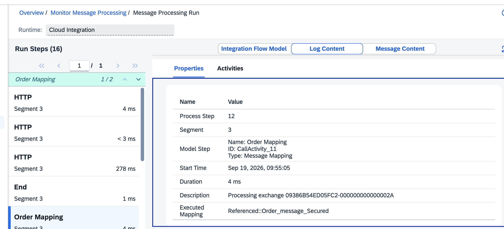 | Order Mapping step properties in Monitor Message Processing, confirming `Executed Mapping: Referenced::Order_message_Secured`. |
| 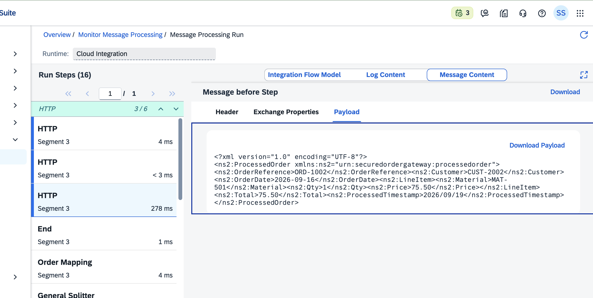 | The mapped `ProcessedOrder` XML immediately before the outbound HTTP call to Receiver1. |
| 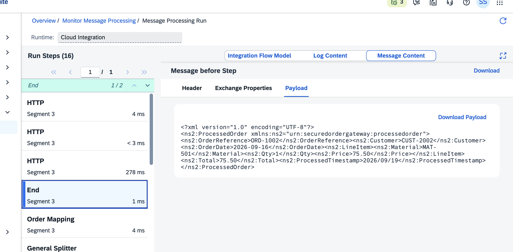 | The same payload confirmed again at the End event — the message that's actually returned to the caller. |
| 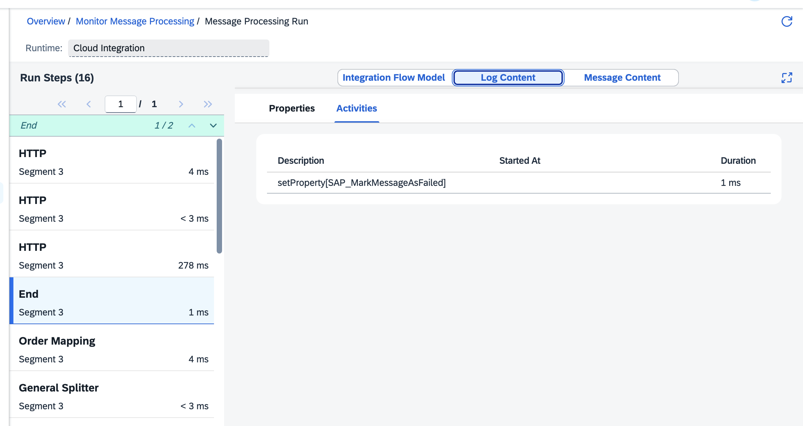 | `setProperty[SAP_MarkMessageAsFailed]` in Log Content → Activities — CPI's own fast signal that a run failed, before even opening the payload. |
| 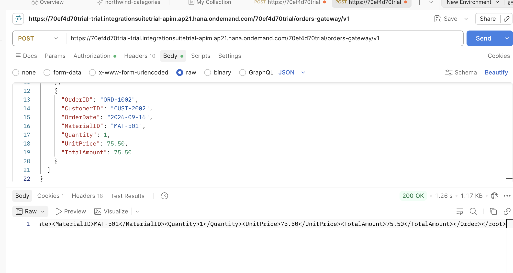 | A 2-order batch POST from Postman returning `200 OK`, confirming the request and intermediate structure end to end. |

---

## 🛠️ Tech Stack

- **SAP Integration Suite** (Cloud Integration + API Management, trial tenant)
- **General Splitter** with XPath expressions
- **Graphical Message Mapping**
- **Gather** step for split/merge aggregation
- **Exception Subprocess** for structured error handling
- **Postman** and **curl** for end-to-end API testing, including concurrency/rate-limit testing

---

## 📂 Repository Structure

```
/iflow-design/          → SecuredOrderGateway_iFlow design artifacts
/mapping-schemas/       → Order.xsd, ProcessedOrder.xsd source/target schemas
/api-policies/          → Verify API Key, Spike Arrest, Quota policy XML
/postman/               → Sample request collections
/screenshots/           → All screenshots referenced in this README, plus a few extra reference/debugging captures (numbered 01–31)
README.md
```

> The `/screenshots/` folder includes a few captures not inlined above — an earlier draft of the Quota policy (`19-apim-quota-policy-draft-v1.png`), a duplicate Target Endpoint view (`14-apim-view-api-target-endpoint-2.png`), a partial Quota policy view (`17-apim-quota-policy-header-partial.png`), the Developer Hub landing page (`22-devhub-landing-loading.png`), a terminal capture from mid-debugging the payload structure (`28-terminal-payload-wrong-dquote-stuck.png`), and one unusable blank capture (`31-blank-uncertain.png`) — kept for a complete record of the build process.

---

## 🚀 Setup & Deployment

1. Deploy `SecuredOrderGateway_iFlow` in SAP Cloud Integration.
2. Create an API Provider (`SecuredOrderGateway_API`) pointing to the CPI runtime endpoint, target URL `/http/orders/batch`.
3. Create an API Proxy (`SecuredOrderGateway_API_Proxy`) referencing that Provider, with the PreFlow policies applied in order: Verify API Key → Spike Arrest → Quota.
4. Create an API Product (`Secured_GateWay_Product`) in the Developer Hub, associating the API Proxy.
5. Create an App (`Secured_GateWay_App`) subscribed to that Product to generate a Consumer Key/Secret — this is the `apikey` value used in requests.
6. Test using the Postman collection or curl, passing `apikey` as a header or query parameter and Basic Auth credentials for the API Management runtime itself.

| | |
|---|---|
| 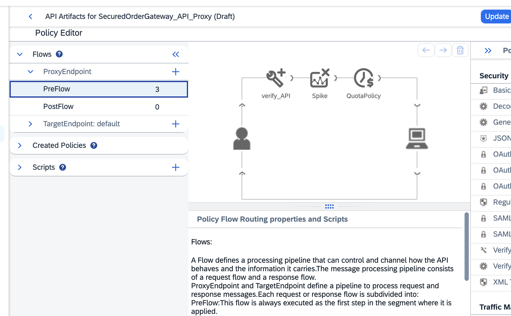 | The PreFlow policy chain in the Policy Editor: Verify API Key → Spike Arrest → Quota. |
| 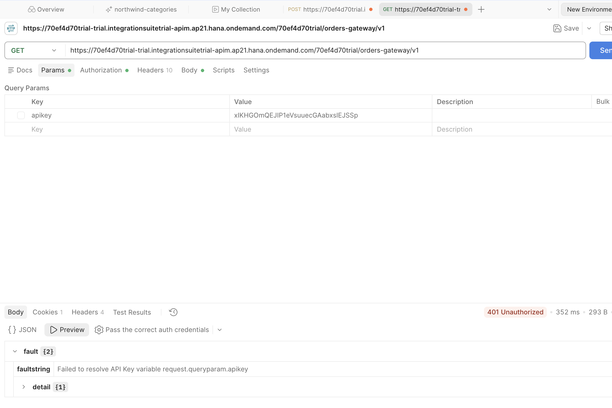 | The API Proxy's Target Endpoint, pointing to API Provider `SecuredOrderGateway_API` at URL `/http/orders/batch`. |
| 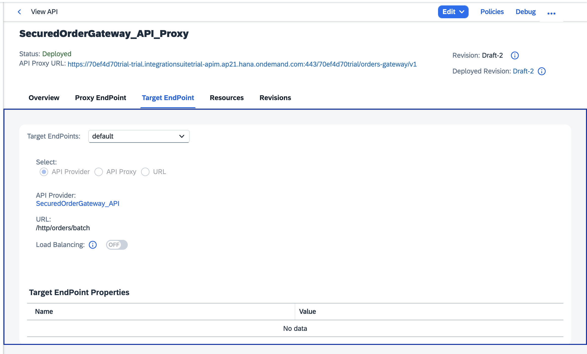 | `VerifyAPIKey` policy XML — reads the key from `request.queryparam.apikey`. |
| 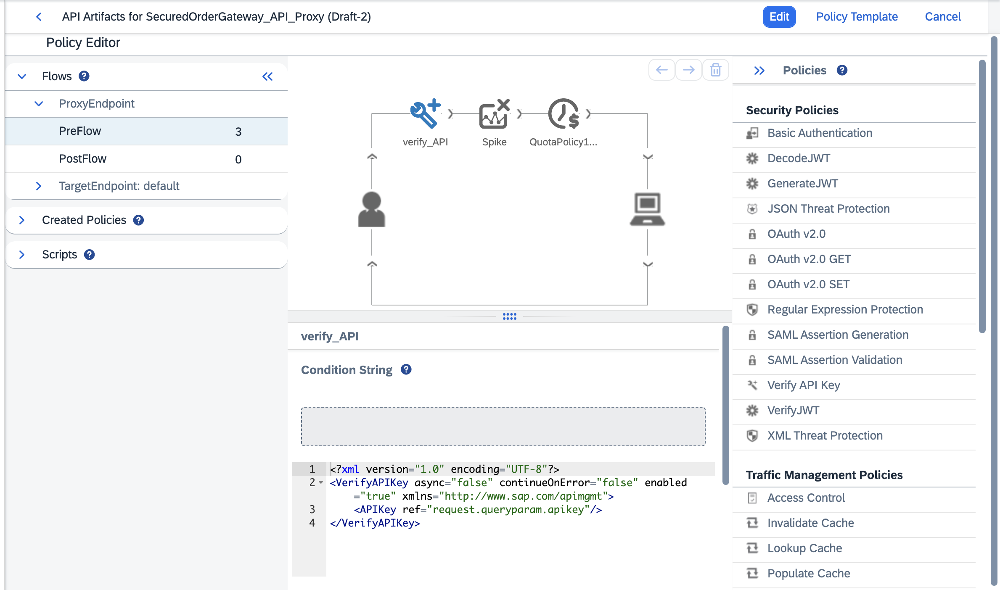 | `SpikeArrest` policy XML — `10ps` rate, reading the key from `request.header.apikey` (note the location mismatch vs. VerifyAPIKey — see Lessons Learned). |
| 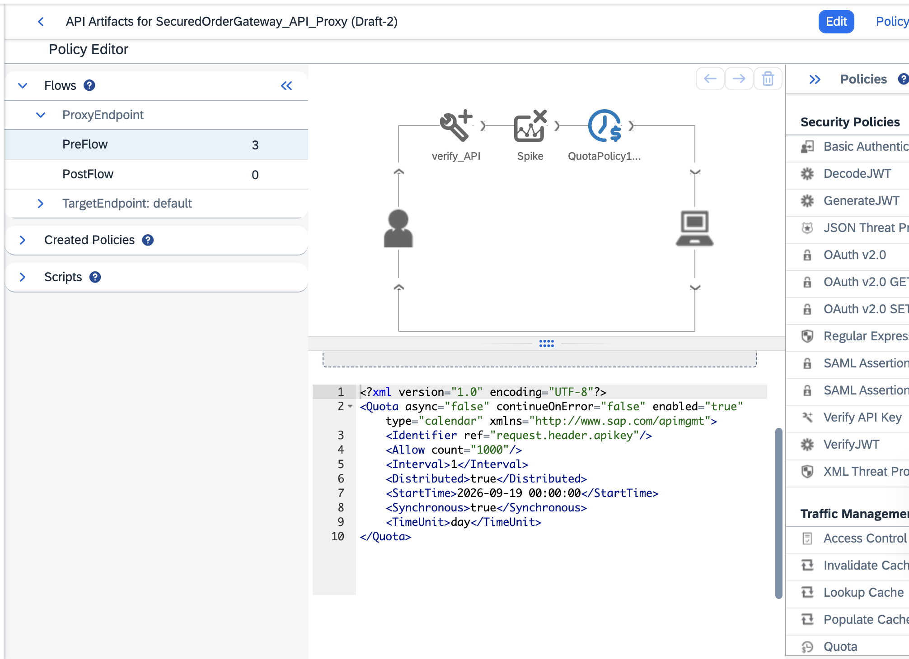 | `Quota` policy XML — `1000` requests per `day`, `Distributed: true`, `Synchronous: true`. |
| 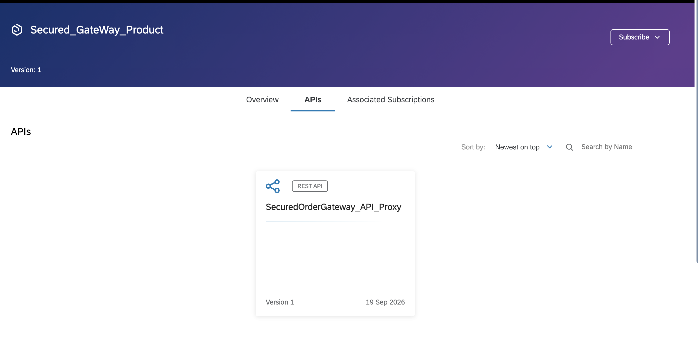 | `Secured_GateWay_Product` in the Developer Hub, exposing `SecuredOrderGateway_API_Proxy`. |
| 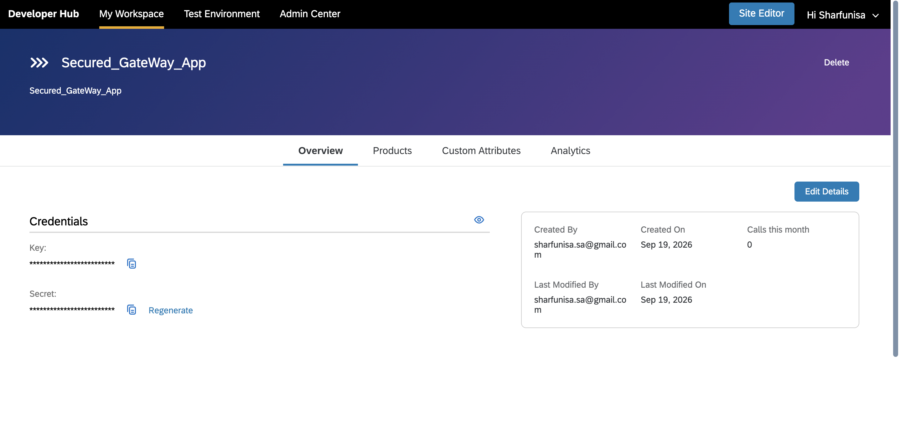 | `Secured_GateWay_App`, subscribed to the Product — this is where the Consumer Key (`apikey`) and Secret are generated. |

---

## ✅ Test Cases

| # | Scenario | Method | Expected Result | Actual Result |
|---|---|---|---|---|
| 1 | Valid batch, valid API key | POST with valid `Order` array and `apikey` | 200, aggregated `ProcessedOrder` XML for all orders | ✅ Confirmed with 2-order batch |
| 2 | Missing/invalid API key | Omit or corrupt `apikey` | 401, `FailedToResolveAPIKey` fault | ✅ Confirmed |
| 3 | Exceed Spike Arrest rate | 15 concurrent POST requests fired in parallel (background curl processes) | Requests beyond 10/sec rejected | ✅ 12/15 rejected — `SpikeArrestViolation`, HTTP 500; 3/15 succeeded |
| 4 | Exceed daily Quota | Accumulated request volume during testing exceeded 1000/day | Requests beyond quota rejected | ✅ Rejected — `QuotaViolation`, HTTP 500, `Identifier: _default` |
| 5 | Malformed JSON body | POST with structurally invalid or mismatched payload | Exception Subprocess triggers, clean JSON error | ✅ Confirmed |
| 6 | Batch with one invalid order among valid ones | Mixed-validity batch | Confirms whether Splitter/Gather processes the good ones or fails the whole batch | ⏳ Not yet tested — documented as a known gap |
| 7 | Empty `Order` array | POST with `{"Order": []}` | Should not error ungracefully | ⏳ Not yet tested |
| 8 | Duplicate `OrderID` in same batch | Two orders with identical `OrderID` | No idempotency check currently exists — documented as a known limitation, not a passing test | ⏳ Not yet tested |
| 9 | Direct call to CPI endpoint bypassing API Management | POST directly to the CPI Sender endpoint | Confirms CPI's own auth still rejects unauthenticated calls | ⏳ Not yet tested |

### Test evidence

| | |
|---|---|
| 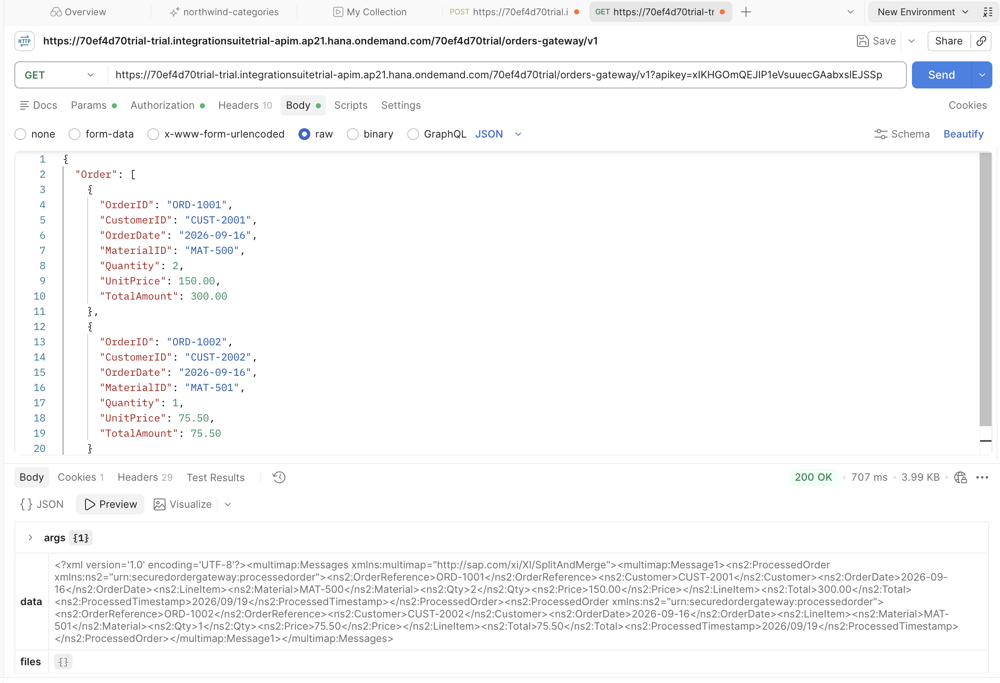 | Test 2: `apikey` sent but the parameter checkbox left unchecked in Postman — `Failed to resolve API Key variable request.queryparam.apikey`, HTTP 401. |
| 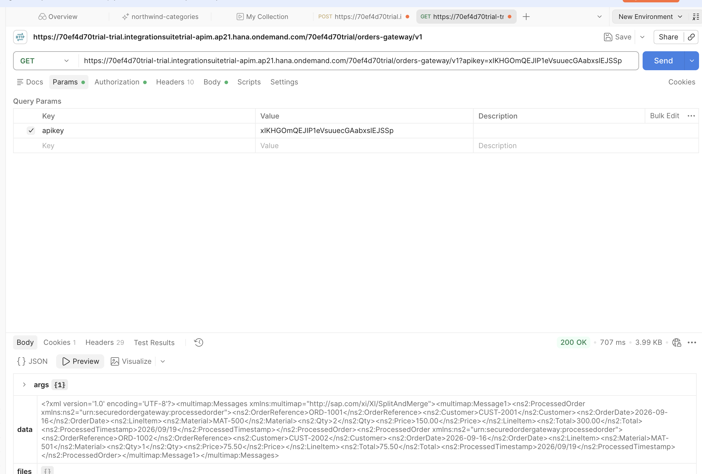 | Same fault, closer view of the unchecked Params checkbox that caused it — a disabled checkbox looks identical to a missing value. |
| 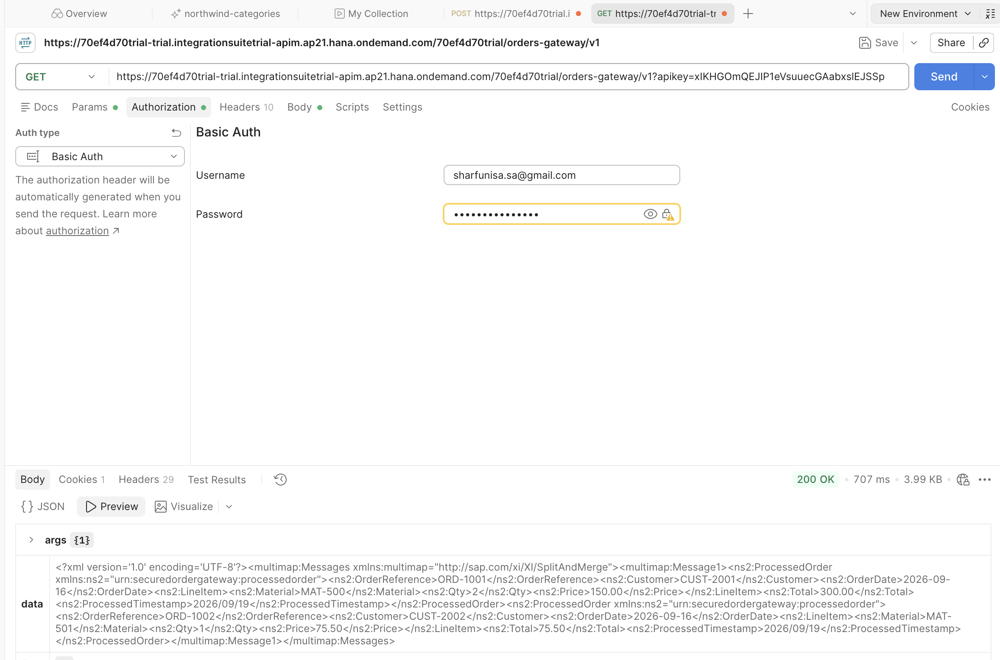 | The Basic Auth layer (separate from `apikey`) required by the API Management runtime itself — easy to overlook as a second auth layer. |
| 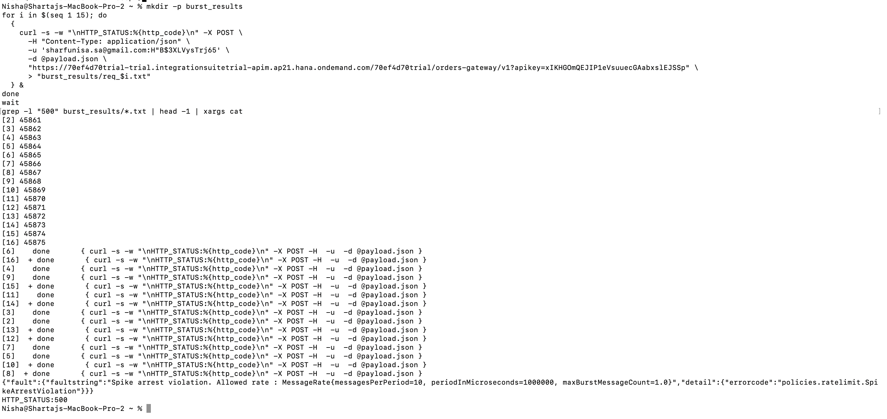 | Test 3: 15 concurrent curl requests fired in parallel; `grep` isolates the failing response body — `SpikeArrestViolation`, HTTP 500. |
| 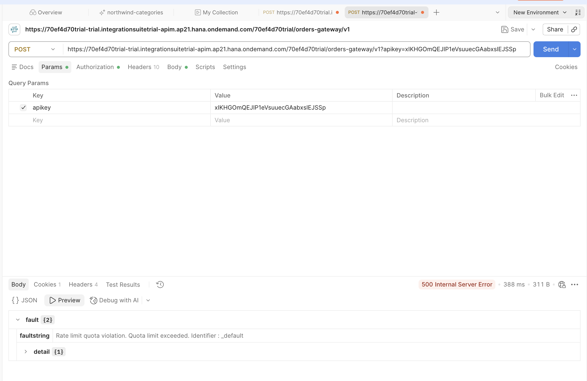 | Test 4: accumulated daily traffic tripped the real `1000/day` Quota — `Rate limit quota violation. Identifier : _default`, HTTP 500. |
| 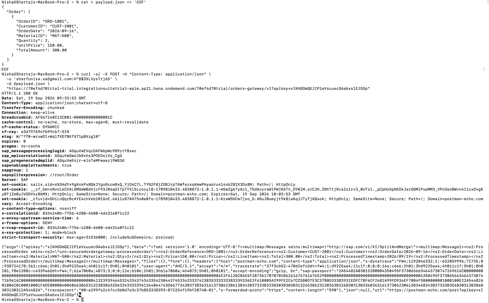 | A successful curl POST, with the response headers revealing `sapsplitexpression: //root/Order` — the detail that confirmed the deployed Splitter's real XPath. |

---

## 🎓 Lessons Learned

- **A wrong mapping reference doesn't announce itself at deploy time.** Message Mapping 1 was pointed at an unrelated `ProductHierarchyMapping` from an earlier project. The iFlow deployed cleanly — CPI only checks structural compatibility at runtime, not design time — so it silently failed the first time it actually processed a real message.
- **Reusing a mapping conceptually isn't the same as reusing it structurally.** "Order" and "Product" felt like they could share logic, but the source schema had nowhere to hold real order fields. Building a dedicated `Order.xsd` → `ProcessedOrder.xsd` mapping was the right call over forcing the fit.
- **API key location has to match across every policy, not just one.** `VerifyAPIKey` checked `request.queryparam.apikey`, while `SpikeArrest` and `Quota` both referenced `request.header.apikey`. All three need to agree on where the key lives, or downstream policies silently evaluate against an empty value.
- **A disabled checkbox looks identical to a missing value.** A `Failed to resolve API Key` fault on a request that clearly had an `apikey` param turned out to be an unchecked box next to the param in Postman — not a policy bug. Worth ruling out the obvious before debugging the policy chain.
- **CPI's built-in failure marking is a fast diagnostic on its own.** Watching for `setProperty[SAP_MarkMessageAsFailed]` in the Log Content → Activities view confirms the platform flagged a run as failed before you even open the payload.
- **Not all rate-limit violations return 429.** Both `SpikeArrestViolation` and `QuotaViolation` return HTTP 500 with a structured fault body. Testing tools or client code that only check for 429 to detect throttling would silently misclassify this as a generic server error instead of a rate-limit rejection.
- **Sequential requests, however fast, may not trip Spike Arrest — but truly concurrent ones will.** Five back-to-back single curl calls all succeeded cleanly; fifteen fired in parallel (`&` + `wait`) reliably triggered the violation. The distinction between "fast" and "simultaneous" matters when reproducing rate-limit behavior.
- **Gather's multimap output nests all results under a single message slot, not one per split branch.** With a 2-order batch, both `ProcessedOrder` blocks came back inside one `Message1` wrapper — surprising if you expect one message slot per split message, and easy to mistake for a bug rather than Gather's actual default behavior.
- **The JSON-to-XML converter's root-wrapping setting silently decides your Splitter's XPath.** With "Add XML Root Element" set to `root`, every payload lands under `<root>...</root>` regardless of the JSON's own top-level key names — meaning the Splitter's XPath (`//root/Order`) is a function of this converter setting, not of the original JSON shape.

### What I'd do differently next time
- Build the Order-specific schema and mapping *before* wiring the Splitter to any borrowed mapping — would have caught the mismatch pre-deployment.
- Standardize the API key parameter location (header **or** query param, not both) across API Management, Postman, and the iFlow's own auth from the start.
- Document the JSON-to-XML converter's root-element setting up front, since it silently determines every downstream XPath expression in the flow.

---

## ⚠️ Known Limitations

- **Receiver1 forwards to `postman-echo.com`** as a mock downstream system in this trial environment; a production deployment would point to a real order-management endpoint.
- **No idempotency check** — duplicate `OrderID`s within a batch are not detected or rejected.
- **No client-certificate (mTLS) validation on the public-facing proxy** — only API key and Basic Auth are currently enforced at the API Management layer (mTLS was validated separately on the receiver adapter's outbound connection, not the inbound proxy).
- **API key location is inconsistent** across policies (see Lessons Learned) — functionally works when the key is sent both as header and query param, but should be standardized.

---

## 🔭 Upcoming

- **Fiori app for order monitoring**: a Fiori Elements List Report reading from a CDS view over a Data Store or table logging each processed order (`OrderID`, status, `ProcessedTimestamp`, error message if any). This would turn the Exception Subprocess's error handling into something visible — a real ops dashboard rather than just a JSON error response — and gives the project a visual, interactive front end beyond Postman/curl testing.
- Batch reconciliation using General Splitter to detect records silently lost mid-batch, rather than just ones that errored.
- Exception Handling & Retry framework (Data Store Write/Select/Delete + exception subprocess pattern) aimed at the message-failure/retry pattern common in real-world CPI production support.

---

## 👤 Author

**Sharfunisa Shajahan (Nisha)**
SAP ABAP & Integration Developer
[Portfolio](https://nishaweb-developer.github.io/myworks) · [GitHub](https://github.com/Nishaweb-developer)
