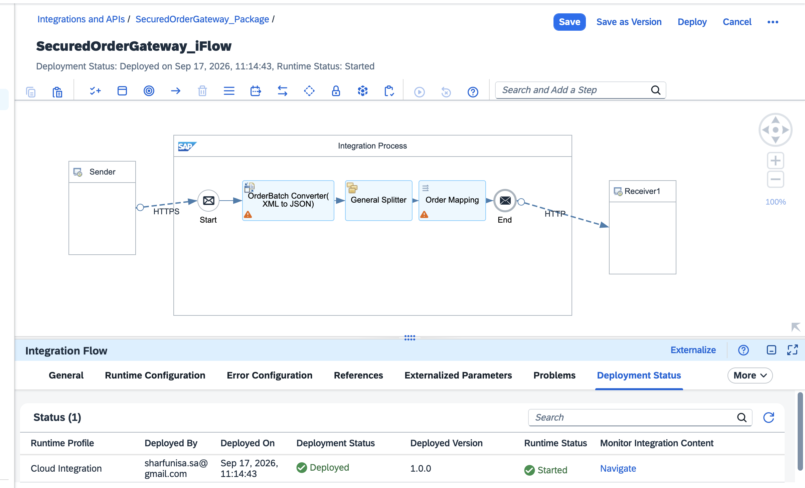
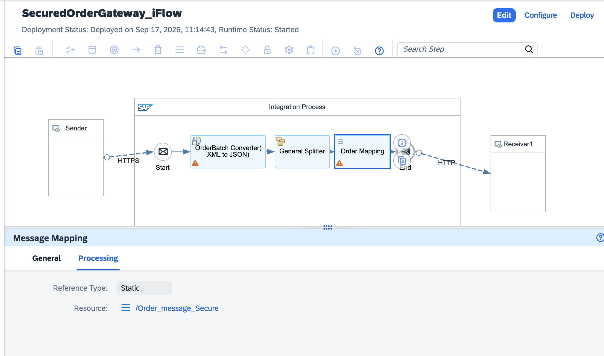
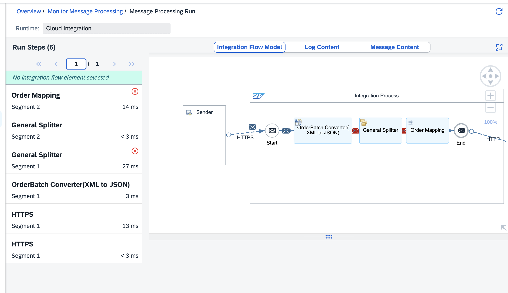
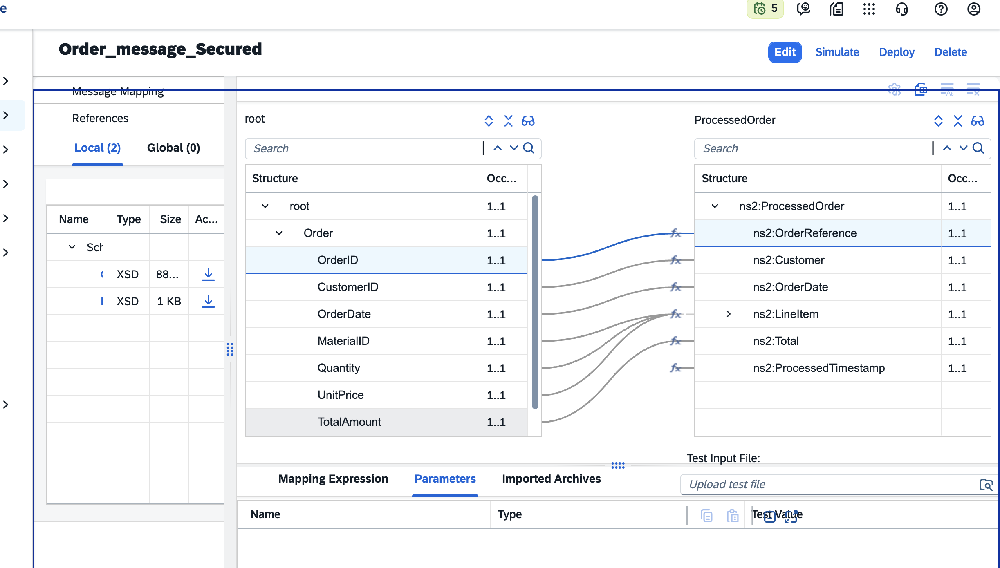
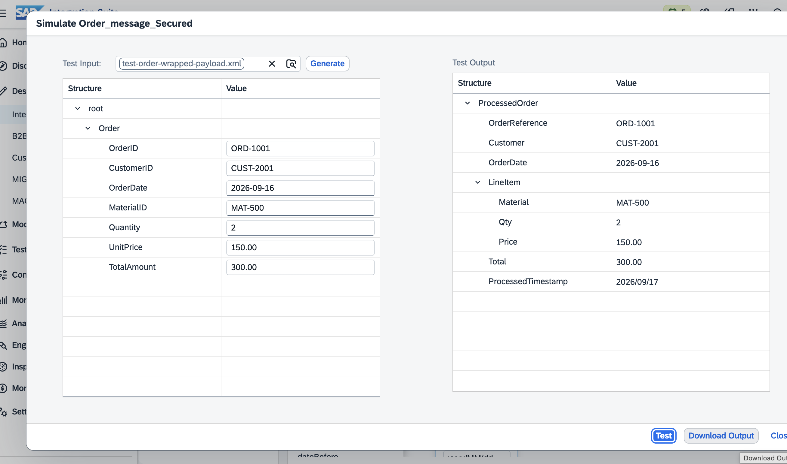

# Secured Order Gateway

A hands-on SAP BTP build: a Cloud Integration (CPI) flow that ingests batched
orders, splits and maps them, and (next up) hands them off to an API
Management proxy for security enforcement before delivery.

Built and debugged on a live SAP BTP trial tenant — trace logs, real errors,
and all. This README documents the project as it stands and grows.

---

## Status

- ✅ **Part 1 — CPI Integration Flow: Done**
- 🔜 **Part 2 — API Management Proxy Integration: In progress**
- 🔜 **Part 3 — RAP + Fiori Elements side-by-side extension app: Planned**

---

## Part 1: CPI Integration Flow

### What it does

`SecuredOrderGateway_iFlow` receives a batch of orders over HTTPS as JSON,
converts them to XML, splits the batch into individual order records,
maps each one into a `ProcessedOrder` structure, and forwards each to a
receiver system.

**Flow:** `HTTPS Start → JSON→XML Converter (OrderBatch) → General Splitter →
Message Mapping (Order → ProcessedOrder) → HTTP Receiver`


*Deployed, working flow: Start → OrderBatch Converter → General Splitter → Order Mapping → End → HTTP*

### The debugging journey

The same error message — `Cannot produce target element .../OrderReference.
Queue has not enough values in context` — showed up three times, for three
different underlying reasons. Documenting all three because the wrong fix
looking like progress is the most common way this kind of bug wastes time.

**Round 1 — Namespace mismatch**
The mapping's source schema declared a namespace (`ns1`) that the actual
JSON→XML converter output never carried, since the source JSON had no
namespace-prefixed keys. Fixed by rebuilding the source XSD without a
`targetNamespace`.

<!-- SCREENSHOT NEEDED: Message Mapping editor showing the source Order tree
     before/after the namespace fix — not yet captured, add when available -->

**Round 2 — Stale mapping reference**
Two separate Message Mapping design objects existed with near-identical
names. The iFlow's mapping step was still pointing at the old one even
after the "fixed" mapping was updated. Resolved by recreating the mapping
cleanly and reconfirming the iFlow step's reference.


*iFlow's Message Mapping step confirmed pointing at the correct resource: `/Order_message_Secured`*

**Round 3 — The actual root cause**
Pulled the raw payload directly out of the Message Processing Log (MPL) at
each step instead of trusting the visual mapping canvas. The General
Splitter's XPath-based split (`//root/Order`) doesn't promote the matched
node to a bare new document root — it reconstructs the ancestor `<root>`
wrapper around each split record. The mapping's source schema expected
`<Order>` as the literal document root and was never going to get one.

Confirmed via the exact bytes in the trace:

```xml
<!-- What the mapping was built to expect: -->
<Order><OrderID>ORD-1001</OrderID>...</Order>

<!-- What the splitter actually produces: -->
<root><Order><OrderID>ORD-1001</OrderID>...</Order></root>
```

Fixed by rebuilding the source schema to have `root` as the document root,
wrapping a single `Order` child — matching reality instead of assumption.
Verified with the mapping's built-in Simulate tool against the real wrapped
payload before redeploying.


*Live retest after redeploying — 200 OK, all order records processed*


*Mapping editor showing `root → ProcessedOrder` field-level mappings, `OrderID` traced to `OrderReference`*


*Simulate test against the real wrapped payload — OrderReference, Customer, LineItem, Total, and ProcessedTimestamp all populated correctly*

### Key lesson

The trace log's actual payload beats any assumption about what a step
"should" be doing. Two of three debugging rounds targeted a plausible,
reasonable-looking cause that wasn't it. The one that worked came from
reading the literal bytes at each step rather than reasoning about the
canvas.

---

## Part 2: API Management Integration (in progress)

**Plan:**
1. Order request comes in → CPI picks it up
2. CPI calls out to a `SecuredOrderGateway` API Management proxy, which
   validates the request (Verify API Key / OAuth2) and stamps security
   headers
3. Spike Arrest + Quota policies protect against burst/excess traffic
4. CPI logs the full round trip as proof the handshake actually happened

<!-- SCREENSHOT: API Management proxy policy configuration once built -->
<!-- SCREENSHOT: End-to-end trace showing CPI → API Management → CPI round trip -->

This section will be filled in as Part 2 progresses.

---

## Part 3: RAP + Fiori Elements Extension App (planned)

Folding this same secured gateway pattern into a full side-by-side
extension app on BTP — CDS Behavior Definition, Fiori Elements UI, backed
by the same integration flow.

---

## Tech

`SAP BTP` · `SAP Integration Suite (Cloud Integration)` · `API Management`
· `Message Mapping` · `General Splitter` · `HTTPS/HTTP Adapters`
· *(planned: RAP, CDS Behavior Definitions, Fiori Elements)*
